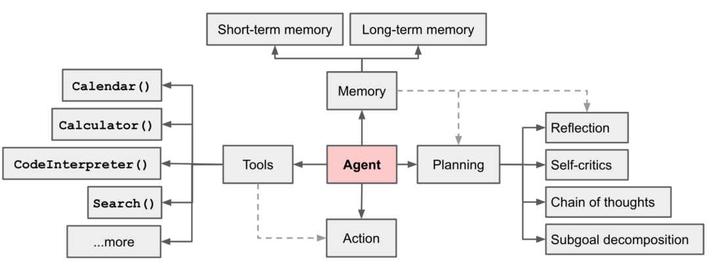
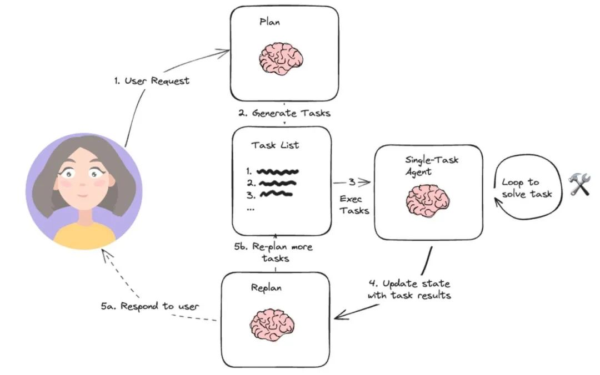

# Awesome-Artificial-Intelligence

从最广义上讲，人工智能 （AI） 是机器，尤其是计算机系统所展示的智能。它是计算机科学的一个研究领域，它开发和研究方法和软件，使机器能够感知其环境，并利用学习和智能采取行动，最大限度地提高实现既定目标的机会，这种机器可以称为人工智能。

---

## 1. LMs

### (1) LLM OS

1. Memory Management
- 大模型上下文长度：200K tokens

2. File System
- 对话历史记录：用于长上下文对话
- 知识库：用于学习个性化的数据和习惯

3. Driver
- Function Call：函数调用，与现有的操作系统，软件进行交互

4. User Interface
- CLI/GUI
- 文本交互：对话式交互
- 语音交互：自然语言交互
- 视频交互：察言观色

Reference: 
https://docs.phidata.com/introduction 
https://github.com/phidatahq/phidata

### (2) Multi-modal LM

1. Type
- Text
- Voice
- Image
- Video
- File

2. Multi-modal LM Engine
- GPT-4o

3. Application
- ChatGPT Desktop: https://openai.com/chatgpt/mac/

### (3) Search Enhanced Generation(RAG)

1. RAG流程中存在的问题
- 多类型的文档读取
- 文档的段落分割
- 分割后的文档如何嵌入向量数据库
- 对用户提出问题的处理（扩充，上下文联系）
- 依据用户问题在数据库中的检索技术（粗排）
- 对检索的结果进行排序Ranking（精排）
- 提示词Prompt的设计
- 对大模型的选择、微调
- 对返回结果Response的检查和处理

2. 对大模型的微调
（1）SFT: supervised fine tuning(针对预训练结果来操作)
- 专家数据（放大增强某方面能力）:告诉模型需要做的事情
（2）Alignment: PPO/DPO
- 用户反馈: 告诉模型不要做某些事情
（3）成本（最主要的）
- 业务（和问题、数据相关）
- 问题
- 数据

3. 理解向量数据库与向量检索效率
(1)向量检索效率O(N):取决于向量数据库的向量个数
(2)向量相似度的计算O(d):向量之间的余弦夹角，取决于向量的维度
(3)整个向量检索效率O(N)*O(d)：向量数据需要解决的问题

4. RAG和微调的选择
- 动态数据: RAG
- 模型能力定制: 微调
- 幻觉: RAG > 微调
- 可解释性: RAG
- 成本: RAG
- 依赖通用能力: RAG
- 延迟: 微调
- 智能设备: 微调

5. 微调
- 全量微调：Model size X (~6)
- 高效微调(PEFT)：LoRA -> Model size + 2% X 5 X Model size
- QLoRA: Quantum LoRA -> Model size/2 + 2% X 5 X Model size (矩阵分解)

6. 提示词工程 Vs RAG Vs 微调（先后顺序）
- 问题没问清楚：提示词工程
- 缺乏相关知识：RAG
- 能力不足：微调

### (4) Reinforcement Learning with Human Feedback(RLHF)

1. Phase 1: Training
> 使用大量数据进行预训练通用模型。

2. Phase 2: SFT
> 使用领域专家数据进行微调。

3. Phase 3: Alignment
> 利用Mentor（Reward Model）对AI的推理结果进行打分形成反馈数据，用于大模型训练和参数更新。

### (5) Mixture of Experts(MoE)

1. Sparse
> Token进入模型后，经过Router只激活少数相关性高的专家模型。

2. Diverse
> 训练多个专家模型，每个模型都有自己的能力和特长，从而体现特殊性和差异性。

3. 合理分配
> 针对不同用户接入大模型，需要对专家模型的资源进行合理地分配，以最大化地利用模型的能力解决问题。

### (6) Self-Attention

> 对序列中的Token分别加权更新，从而使每个Token更接近序列中的含义。句子序列中Token的个数为n，进行推理的计算成本为N^2，随着句子序列长度的增加推理的计算成本会变的非常大，因此Transformer的这个问题需要解决，目前比较火的用于解决该问题的为mamba架构。

### (7) Large Model(LM) deployed on Cloud Server

1. 服务器选择
- Alibaba Cloud
- Amazon Cloud
- Google Cloud
- Microsoft Cloud
- Oracle Cloud
- Tencent Cloud

2. 安装系统

3. 安装依赖

4. 安装Ollama

5. 安装docker及OpenWeb UI

6. 安装ngrok

7. 配置agent

8. 运行测试

### (8) Large Model(LM) deployed on Local Host

1. 安装并运行Ollama
- 前往Ollama官方网站（https://ollama.com/）下载所需要系统版本的Ollama应用；
- 在系统命令行终端中运行：ollama run llama3(你所需要的LLM，可供选择的LLM参考https://ollama.com/library)

2. 安装并启用OpenWeb UI

3. 安装内网穿透工具ngrok用于端侧访问

4. 安装并构造本地RAG知识库

5. 赋予大模型在线联网搜索能力

---

## 2. Agents

### (1) Agent基础

代理（Agent）指能自主感知环境并采取行动实现目标的智能体，即AI作为一个人或一个组织的代表，进行某种特定行为和交易，降低一个人或组织的工作复杂程度，减少工作量和沟通成本。

Agent的核心决策逻辑是让LLM根据动态变化的环境信息选择执行具体的行动或者对结果作出判断，并影响环境，通过多轮迭代重复执行上述步骤，直到完成目标。

精简的决策流程：P（感知）-> P（规划）-> A（行动） 
感知（Perception）是指Agent从环境中收集信息并从中提取相关知识的能力。 
规划（Planning）是指Agent为了某一目标而作出的决策过程。 
行动（Action）是指基于环境和规划做出的动作。 

其中，Policy是Agent做出Action的核心决策，而行动又通过观察（Observation）成为进一步Perception的前提和基础，形成自主地闭环学习过程。

工程实现上可以拆分出四大块核心模块：推理、记忆、工具、行动。

### (2) 决策模型

目前Agent主流的决策模型是ReAct框架，也有一些ReAct的变种框架，以下是两种框架的对比。

1. 传统ReAct框架：Reason and Act

ReAct=少样本prompt + Thought + Action + Observation 。是调用工具、推理和规划时常用的prompt结构，先推理再执行，根据环境来执行具体的action，并给出思考过程Thought。

2. 新框架：Plan-and-Execute ReAct

类BabyAgi的执行流程：一部分Agent通过优化规划和任务执行的流程来完成复杂任务的拆解，将复杂的任务拆解成多个子任务，再依次/批量执行。 
优点是对于解决复杂任务、需要调用多个工具时，也只需要调用三次大模型，而不是每次工具调用都要调大模型。

LLmCompiler：并行执行任务，规划时生成一个DAG图来执行action，可以理解成将多个工具聚合成一个工具执行图，用图的方式执行某一个action。 
paper：https://arxiv.org/abs/2312.04511?ref=blog.langchain.dev

3. 框架对比

### (3) Agent框架

根据框架和实现方式的差异，这里简单将Agent框架分为两大类：Single-Agent和Multi-Agent，分别对应单智能体和多智能体架构，Multi-Agent使用多个智能体来解决更复杂的问题。

1. Single-Agent Framework

- BabyAGI 
github：https://github.com/yoheinakajima/babyagi/ 
doc：https://yoheinakajima.com/birth-of-babyagi/

- AutoGPT 
github：https://github.com/Significant-Gravitas/AutoGPT

- HuggingGPT 
github: https://github.com/microsoft/JARVIS 
paper: https://arxiv.org/abs/2303.17580

- GPT-Engineer 
github: https://github.com/AntonOsika/gpt-engineer

- Samantha 
github: https://github.com/BRlkl/AGI-Samantha 
twitter: https://twitter.com/Schindler___/status/1745986132737769573

- AppAgent 
github：https://github.com/X-PLUG/MobileAgent 
doc：https://appagent-official.github.io/

- OS-Copilot 
github：https://github.com/OS-Copilot/FRIDAY 
doc：https://os-copilot.github.io/

- LangGraph 
github：https://github.com/langchain-ai/langgraph 
doc：https://python.langchain.com/docs/langgraph

- FlowiseAI 
github：https://github.com/FlowiseAI/Flowise 
doc：https://docs.flowiseai.com/

- Dify 
github：https://github.com/langgenius/dify 
doc：https://docs.dify.ai/

2. Multi-Agent Framework

- 斯坦福虚拟小镇 
github：https://github.com/joonspk-research/generative_agents 
paper：https://arxiv.org/abs/2304.03442

- MetaGPT 
github：https://github.com/geekan/MetaGPT 
doc：https://docs.deepwisdom.ai/main/zh/guide/get_started/introduction.html

- AutoGen 
github：https://github.com/microsoft/autogen 
doc：https://microsoft.github.io/autogen/docs/Getting-Started

- ChatDEV 
github：https://github.com/OpenBMB/ChatDev 
doc：https://chatdev.modelbest.cn/introduce

- GPTeam 
github：https://github.com/101dotxyz/GPTeam

- GPT Researcher 
github：https://github.com/assafelovic/gpt-researcher

- TaskWeaver 
github：https://github.com/microsoft/TaskWeaver?tab=readme-ov-file 
doc：https://microsoft.github.io/TaskWeaver/docs/overview

- Microsoft UFO 
github：https://github.com/microsoft/UFO

- CrewAI 
github: https://github.com/joaomdmoura/crewAI 
site: https://www.crewai.com/

- MemGPT 
github: https://github.com/cpacker/MemGPT 
site: https://memgpt.ai/

- AgentScope 
github: https://github.com/modelscope/agentscope/blob/main/README_ZH.md

- Camel 
github: https://github.com/camel-ai/camel 
site: https://www.camel-ai.org

3. Reference

截止至今日，开源的Agent应用可以说是百花齐放，文章也是挑选了热度和讨论度较高的19类Agent，基本能覆盖主流的Agent框架，每个类型都做了一个简单的summary、作为一个参考供大家学习。 

GitHub: https://github.com/e2b-dev/awesome-ai-agents

### (4) Agent框架总结

单智能体 = 大语言模型（LLM） + 观察（obs） + 思考（thought） + 行动（act） + 记忆（mem） 
多智能体 = 智能体 + 环境 + SOP + 评审 + 通信 + 成本 

多智能体优点： 
多视角分析问题：虽然LLM可以扮演很多视角，但会随着system prompt或者前几轮的对话快速坍缩到某个具体的视角上； 
复杂问题拆解：每个子agent负责解决特定领域的问题，降低对记忆和prompt长度的要求； 
可操控性强：可以自主的选择需要的视角和人设； 
开闭原则：通过增加子agent来扩展功能，新增功能无需修改之前的agent； 
（可能）更快的解决问题：解决单agent并发的问题； 

多智能体缺点： 
成本和耗时的增加； 
交互更复杂、定制开发成本高； 
简单的问题single Agent也能解决； 

多智能体能解决的问题： 
解决复杂问题； 
生成多角色交互的剧情； 

Multi-Agent并不是Agent框架的终态，Multi-Agent框架是当前有限的LLM能力背景下的产物，更多还是为了解决当前LLM的能力缺陷，通过LLM多次迭代、弥补一些显而易见的错误，不同框架间仍然存在着极高的学习和开发成本。随着LLM能力的提升，未来的Agent框架肯定会朝着更加的简单、易用的方向发展。

### (5) 智能体能做什么

1. 可能的方向
> 游戏场景（npc对话、游戏素材生产）、内容生产、私域助理、OS级别智能体、部分工作的提效。

2. Single Agent框架
> 执行架构优化：
CoT to XoT，从一个thought一步act到一个thought多个act，从链式的思考方式到多维度思考； 
长期记忆的优化：
具备个性化能力的agent，模拟人的回想过程，将长期记忆加入agent中； 
多模态能力建设：
agent能观察到的不仅限于用户输入的问题，可以加入包括触觉、视觉、对周围环境的感知等； 
自我思考能力：
主动提出问题，自我优化； 

3. Multi-Agent框架
> 多agent应该像人类的大脑一样，分工明确、又能一起协作，比如，大脑有负责视觉、味觉、触觉、行走、平衡，甚至控制四肢行走的区域都不一样。 
参考MetaGPT和AutoGen生态最完善的两个Multi-Agent框架，可以从以下几个角度出发： 
环境&通讯：Agent间的交互，消息传递、共同记忆、执行顺序，分布式agent，OS-agent 
SOP：定义SOP，编排自定义Agent 
评审：Agent健壮性保证，输入输出结果解析 
成本：Agent间的资源分配 
Proxy：自定义proxy，可编程、执行大小模型 

4. 其他
> 部署：Agent以及workflow的配置化及服务化，更长远的还需要考虑分布式部署 
监控：Multi-Agent可视化、能耗与成本监控 
RAG：解决语义孤立问题 
评测：agent评测、workflow评测、AgentBench 
训练语料：数据标记、数据回流 
业务选择：Copilot 还是 Agent ？Single Agent 还是Multi-Agent？ 

### Reference
(1) https://www.53ai.com/news/qianyanjishu/1418.html 
(2) https://www.icnma.com/multi-agent-framework/

---

## 3. AGI

---
