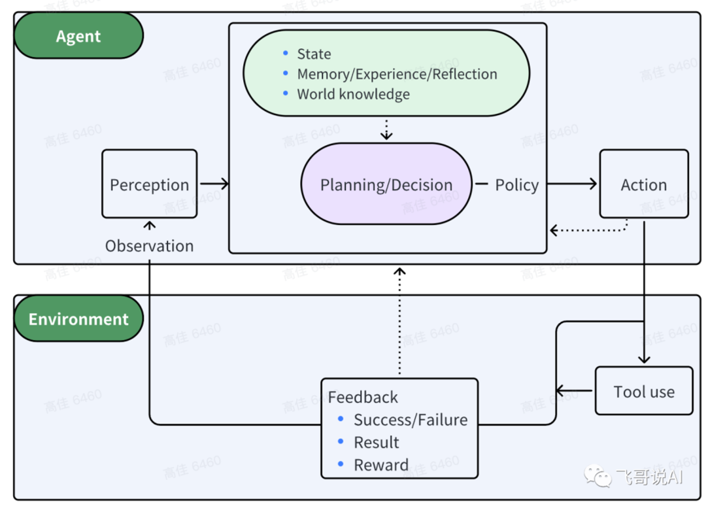
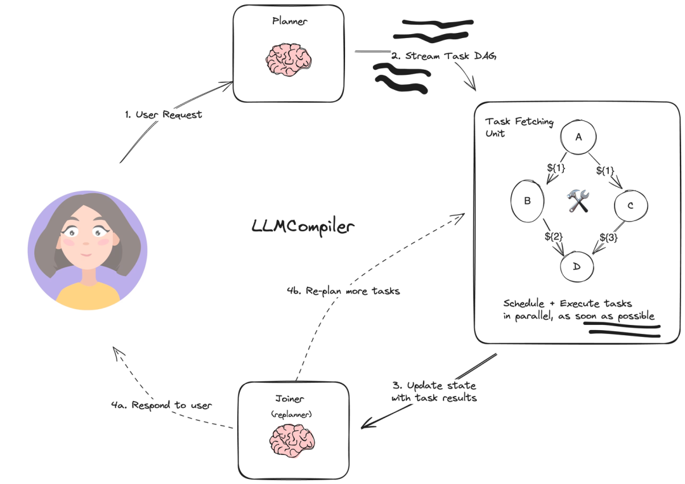

# Awesome-Artificial-Intelligence

> 从最广义上讲，人工智能 （AI） 是机器，尤其是计算机系统所展示的智能。它是计算机科学的一个研究领域，它开发和研究方法和软件，使机器能够感知其环境，并利用学习和智能采取行动，最大限度地提高实现既定目标的机会，这种机器可以称为人工智能。

---

## 1. LMs

### (1) LLM OS

1. Memory Management
- 大模型上下文长度：200K tokens

2. File System
- 对话历史记录：用于长上下文对话
- 知识库：用于学习个性化的数据和习惯

3. Driver
- Function Call：函数调用，与现有的操作系统，软件进行交互

4. User Interface
- CLI/GUI
- 文本交互：对话式交互
- 语音交互：自然语言交互
- 视频交互：察言观色

Reference:<br>
<https://docs.phidata.com/introduction><br>
<https://github.com/phidatahq/phidata>

### (2) Multi-modal LM

1. Type
- Text
- Voice
- Image
- Video
- File

2. Multi-modal LM Engine
- GPT-4o

3. Application
- ChatGPT Desktop: <https://openai.com/chatgpt/mac/>

### (3) Search Enhanced Generation(RAG)

1. RAG流程中存在的问题
- 多类型的文档读取
- 文档的段落分割
- 分割后的文档如何嵌入向量数据库
- 对用户提出问题的处理（扩充，上下文联系）
- 依据用户问题在数据库中的检索技术（粗排）
- 对检索的结果进行排序Ranking（精排）
- 提示词Prompt的设计
- 对大模型的选择、微调
- 对返回结果Response的检查和处理

2. 对大模型的微调
（1）SFT: supervised fine tuning(针对预训练结果来操作)
- 专家数据（放大增强某方面能力）:告诉模型需要做的事情
（2）Alignment: PPO/DPO
- 用户反馈: 告诉模型不要做某些事情
（3）成本（最主要的）
- 业务（和问题、数据相关）
- 问题
- 数据

3. 理解向量数据库与向量检索效率
(1)向量检索效率O(N):取决于向量数据库的向量个数
(2)向量相似度的计算O(d):向量之间的余弦夹角，取决于向量的维度
(3)整个向量检索效率O(N)*O(d)：向量数据需要解决的问题

4. RAG和微调的选择
- 动态数据: RAG
- 模型能力定制: 微调
- 幻觉: RAG > 微调
- 可解释性: RAG
- 成本: RAG
- 依赖通用能力: RAG
- 延迟: 微调
- 智能设备: 微调

5. 微调
- 全量微调：Model size X (~6)
- 高效微调(PEFT)：LoRA -> Model size + 2% X 5 X Model size
- QLoRA: Quantum LoRA -> Model size/2 + 2% X 5 X Model size (矩阵分解)

6. 提示词工程 Vs RAG Vs 微调（先后顺序）
- 问题没问清楚：提示词工程
- 缺乏相关知识：RAG
- 能力不足：微调

### (4) Reinforcement Learning with Human Feedback(RLHF)

1. Phase 1: Training
> 使用大量数据进行预训练通用模型。

2. Phase 2: SFT
> 使用领域专家数据进行微调。

3. Phase 3: Alignment
> 利用Mentor（Reward Model）对AI的推理结果进行打分形成反馈数据，用于大模型训练和参数更新。

### (5) Mixture of Experts(MoE)

1. Sparse
> Token进入模型后，经过Router只激活少数相关性高的专家模型。

2. Diverse
> 训练多个专家模型，每个模型都有自己的能力和特长，从而体现特殊性和差异性。

3. 合理分配
> 针对不同用户接入大模型，需要对专家模型的资源进行合理地分配，以最大化地利用模型的能力解决问题。

### (6) Self-Attention

> 对序列中的Token分别加权更新，从而使每个Token更接近序列中的含义。句子序列中Token的个数为n，进行推理的计算成本为N^2，随着句子序列长度的增加推理的计算成本会变的非常大，因此Transformer的这个问题需要解决，目前比较火的用于解决该问题的为mamba架构。

### (7) CO-STAR Framework

> 在使用大语言模型时，有效的提示构建至关重要。CO-STAR 框架，由新加坡政府科技局数据科学与 AI 团队创立，是一个实用的提示构建工具。它考虑了所有影响大语言模型响应效果和相关性的关键因素，帮助你获得更优的反馈。<br>
> 
>
> **Reference:**
>> (1) <https://www.jackyshen.com/><br>
>> (2) <https://medium.com/@frugalzentennial/unlocking-the-power-of-costar-prompt-engineering-a-guide-and-example-on-converting-goals-into-dc5751ce9875>

#### 1. Context (C)

> 上下文：为任务提供背景信息 通过为大语言模型（LLM）提供详细的背景信息，可以帮助它精确理解讨论的具体场景，确保提供的反馈具有相关性。

#### 2. Objective (O)

> 目标：明确你要求大语言模型完成的任务 清晰地界定任务目标，可以使大语言模型更专注地调整其回应，以实现这一具体目标。

#### 3. Style (S)

> 风格：明确你期望的写作风格 你可以指定一个特定的著名人物或某个行业专家的写作风格，如商业分析师或 CEO。这将指导大语言模型以一种符合你需求的方式和词汇选择进行回应。

#### 4. Tone (T)

> 语气：设置回应的情感调 设定适当的语气，确保大语言模型的回应能够与预期的情感或情绪背景相协调。可能的语气包括正式、幽默、富有同情心等。

#### 5. Audience (A)

> 受众：识别目标受众 针对特定受众定制大语言模型的回应，无论是领域内的专家、初学者还是儿童，都能确保内容在特定上下文中适当且容易理解。

#### 6. Response (R)

> 响应：规定输出的格式 确定输出格式是为了确保大语言模型按照你的具体需求进行输出，便于执行下游任务。常见的格式包括列表、JSON 格式的数据、专业报告等。对于大部分需要程序化处理大语言模型输出的应用来说，JSON 格式是理想的选择。

#### Example of CO-STAR Framework

```text
# CONTEXT # 
I am a personal productivity developer. In the realm of personal development and productivity, there is a growing demand for systems that not only help individuals set goals but also convert those goals into actionable steps. Many struggle with the transition from aspirations to concrete actions, highlighting the need for an effective goal-to-system conversion process.

#########

# OBJECTIVE #
Your task is to guide me in creating a comprehensive system converter. This involves breaking down the process into distinct steps, including identifying the goal, employing the 5 Whys technique, learning core actions, setting intentions, and conducting periodic reviews. The aim is to provide a step-by-step guide for seamlessly transforming goals into actionable plans.

#########

# STYLE #
Write in an informative and instructional style, resembling a guide on personal development. Ensure clarity and coherence in the presentation of each step, catering to an audience keen on enhancing their productivity and goal attainment skills.

#########

# TONE #
 Maintain a positive and motivational tone throughout, fostering a sense of empowerment and encouragement. It should feel like a friendly guide offering valuable insights.

# AUDIENCE #
The target audience is individuals interested in personal development and productivity enhancement. Assume a readership that seeks practical advice and actionable steps to turn their goals into tangible outcomes.

#########

# RESPONSE FORMAT #
Provide a structured list of steps for the goal-to-system conversion process. Each step should be clearly defined, and the overall format should be easy to follow for quick implementation. 

#############

# START ANALYSIS #
If you understand, ask me for my goals.
```

### (8) Large Model(LM) deployed on Cloud Server

1. 服务器选择
- Alibaba Cloud
- Amazon Cloud
- Google Cloud
- Microsoft Cloud
- Oracle Cloud
- Tencent Cloud

2. 安装系统

3. 安装依赖

4. 安装Ollama

5. 安装docker及OpenWeb UI

6. 安装ngrok

7. 配置agent

8. 运行测试

### (9) Large Model(LM) deployed on Local Host

1. 安装并运行Ollama
- 前往Ollama官方网站（<https://ollama.com/>）下载所需要系统版本的Ollama应用；
- 在系统命令行终端中运行：ollama run llama3(你所需要的LLM，可供选择的LLM参考<https://ollama.com/library>)

2. 安装并启用OpenWeb UI

3. 安装内网穿透工具ngrok用于端侧访问

4. 安装并构造本地RAG知识库

5. 赋予大模型在线联网搜索能力

---

## 2. Agents

### (1) Agent基础

代理（Agent）指能自主感知环境并采取行动实现目标的智能体，即AI作为一个人或一个组织的代表，进行某种特定行为和交易，降低一个人或组织的工作复杂程度，减少工作量和沟通成本。

Agent的核心决策逻辑是让LLM根据动态变化的环境信息选择执行具体的行动或者对结果作出判断，并影响环境，通过多轮迭代重复执行上述步骤，直到完成目标。

精简的决策流程：P（感知）-> P（规划）-> A（行动）<br>
感知（Perception）是指Agent从环境中收集信息并从中提取相关知识的能力。<br>
规划（Planning）是指Agent为了某一目标而作出的决策过程。<br>
行动（Action）是指基于环境和规划做出的动作。<br>

其中，Policy是Agent做出Action的核心决策，而行动又通过观察（Observation）成为进一步Perception的前提和基础，形成自主地闭环学习过程。



工程实现上可以拆分出四大块核心模块：推理、记忆、工具、行动。


### (2) 决策模型

目前Agent主流的决策模型是ReAct框架，也有一些ReAct的变种框架，以下是两种框架的对比。

1. 传统ReAct框架：Reason and Act

ReAct=少样本prompt + Thought + Action + Observation 。是调用工具、推理和规划时常用的prompt结构，先推理再执行，根据环境来执行具体的action，并给出思考过程Thought。


2. 新框架：Plan-and-Execute ReAct

类BabyAgi的执行流程：一部分Agent通过优化规划和任务执行的流程来完成复杂任务的拆解，将复杂的任务拆解成多个子任务，再依次/批量执行。<br>
优点是对于解决复杂任务、需要调用多个工具时，也只需要调用三次大模型，而不是每次工具调用都要调大模型。

LLmCompiler：并行执行任务，规划时生成一个DAG图来执行action，可以理解成将多个工具聚合成一个工具执行图，用图的方式执行某一个action。<br>
paper：<https://arxiv.org/abs/2312.04511?ref=blog.langchain.dev>


3. 框架对比


### (3) Agent框架

根据框架和实现方式的差异，这里简单将Agent框架分为两大类：Single-Agent和Multi-Agent，分别对应单智能体和多智能体架构，Multi-Agent使用多个智能体来解决更复杂的问题。

1. Single-Agent Framework

- BabyAGI<br>
github：<https://github.com/yoheinakajima/babyagi/><br>
doc：<https://yoheinakajima.com/birth-of-babyagi/>

- AutoGPT<br>
github：<https://github.com/Significant-Gravitas/AutoGPT>

- HuggingGPT<br>
github: <https://github.com/microsoft/JARVIS><br>
paper: <https://arxiv.org/abs/2303.17580>

- GPT-Engineer<br>
github: <https://github.com/AntonOsika/gpt-engineer>

- Samantha<br>
github: <https://github.com/BRlkl/AGI-Samantha><br>
twitter: <https://twitter.com/Schindler___/status/1745986132737769573>

- AppAgent<br>
github：<https://github.com/X-PLUG/MobileAgent><br>
doc：<https://appagent-official.github.io/>

- OS-Copilot<br>
github：<https://github.com/OS-Copilot/FRIDAY><br>
doc：<https://os-copilot.github.io/>

- LangGraph<br>
github：<https://github.com/langchain-ai/langgraph><br>
doc：<https://python.langchain.com/docs/langgraph>

- FlowiseAI<br>
github：https://github.com/FlowiseAI/Flowise><br>
doc：<https://docs.flowiseai.com/>

- Dify<br>
github：<https://github.com/langgenius/dify<br>
doc：https://docs.dify.ai/

2. Multi-Agent Framework

- 斯坦福虚拟小镇<br>
github：<https://github.com/joonspk-research/generative_agents><br>
paper：<https://arxiv.org/abs/2304.03442>

- MetaGPT<br>
github：<https://github.com/geekan/MetaGPT><br>
doc：<https://docs.deepwisdom.ai/main/zh/guide/get_started/introduction.html>

- AutoGen<br>
github：<https://github.com/microsoft/autogen><br>
doc：<https://microsoft.github.io/autogen/docs/Getting-Started>

- ChatDEV<br>
github：https://github.com/OpenBMB/ChatDev<br>
doc：<https://chatdev.modelbest.cn/introduce>

- GPTeam<br>
github：<https://github.com/101dotxyz/GPTeam>

- GPT Researcher<br>
github：<https://github.com/assafelovic/gpt-researcher>

- TaskWeaver<br>
github：<https://github.com/microsoft/TaskWeaver?tab=readme-ov-file><br>
doc：<https://microsoft.github.io/TaskWeaver/docs/overview>

- Microsoft UFO<br>
github：<https://github.com/microsoft/UFO>

- CrewAI<br>
github: <https://github.com/joaomdmoura/crewAI><br>
site: <https://www.crewai.com/>

- MemGPT<br>
github: <https://github.com/cpacker/MemGPT><br>
site: <https://memgpt.ai/>

- AgentScope<br>
github: <https://github.com/modelscope/agentscope/blob/main/README_ZH.md>

- Camel<br>
github: <https://github.com/camel-ai/camel><br>
site: <https://www.camel-ai.org>

3. Heterogeneous Distributed-Agent framework

- cake<br>
github: <https://github.com/evilsocket/cake>

- exo<br>
github: <https://github.com/exo-explore/exo>

4. Reference

截止至今日，开源的Agent应用可以说是百花齐放，文章也是挑选了热度和讨论度较高的19类Agent，基本能覆盖主流的Agent框架，每个类型都做了一个简单的summary、作为一个参考供大家学习。<br>

GitHub: <https://github.com/e2b-dev/awesome-ai-agents>

### (4) Agent框架总结

单智能体 = 大语言模型（LLM） + 观察（obs） + 思考（thought） + 行动（act） + 记忆（mem）<br>
多智能体 = 智能体 + 环境 + SOP + 评审 + 通信 + 成本<br>

多智能体优点：<br>
多视角分析问题：虽然LLM可以扮演很多视角，但会随着system prompt或者前几轮的对话快速坍缩到某个具体的视角上；<br>
复杂问题拆解：每个子agent负责解决特定领域的问题，降低对记忆和prompt长度的要求；<br>
可操控性强：可以自主的选择需要的视角和人设；<br>
开闭原则：通过增加子agent来扩展功能，新增功能无需修改之前的agent；<br>
（可能）更快的解决问题：解决单agent并发的问题；<br>

多智能体缺点：<br>
成本和耗时的增加；<br>
交互更复杂、定制开发成本高；<br>
简单的问题single Agent也能解决；<br>

多智能体能解决的问题：<br>
解决复杂问题；<br>
生成多角色交互的剧情；<br>

Multi-Agent并不是Agent框架的终态，Multi-Agent框架是当前有限的LLM能力背景下的产物，更多还是为了解决当前LLM的能力缺陷，通过LLM多次迭代、弥补一些显而易见的错误，不同框架间仍然存在着极高的学习和开发成本。随着LLM能力的提升，未来的Agent框架肯定会朝着更加的简单、易用的方向发展。

### (5) 智能体能做什么

1. 可能的方向
> 游戏场景（npc对话、游戏素材生产）、内容生产、私域助理、OS级别智能体、部分工作的提效。

2. Single Agent框架
> 执行架构优化：
CoT to XoT，从一个thought一步act到一个thought多个act，从链式的思考方式到多维度思考；<br>
长期记忆的优化：
具备个性化能力的agent，模拟人的回想过程，将长期记忆加入agent中；<br>
多模态能力建设：
agent能观察到的不仅限于用户输入的问题，可以加入包括触觉、视觉、对周围环境的感知等；<br>
自我思考能力：
主动提出问题，自我优化；<br>

3. Multi-Agent框架
> 多agent应该像人类的大脑一样，分工明确、又能一起协作，比如，大脑有负责视觉、味觉、触觉、行走、平衡，甚至控制四肢行走的区域都不一样。<br>
参考MetaGPT和AutoGen生态最完善的两个Multi-Agent框架，可以从以下几个角度出发：<br>
环境&通讯：Agent间的交互，消息传递、共同记忆、执行顺序，分布式agent，OS-agent<br>
SOP：定义SOP，编排自定义Agent<br>
评审：Agent健壮性保证，输入输出结果解析<br>
成本：Agent间的资源分配<br>
Proxy：自定义proxy，可编程、执行大小模型<br>

4. 其他
> 部署：Agent以及workflow的配置化及服务化，更长远的还需要考虑分布式部署<br>
监控：Multi-Agent可视化、能耗与成本监控<br>
RAG：解决语义孤立问题<br>
评测：agent评测、workflow评测、AgentBench<br>
训练语料：数据标记、数据回流<br>
业务选择：Copilot 还是 Agent ？Single Agent 还是Multi-Agent？<br>

### Reference
(1) <https://www.53ai.com/news/qianyanjishu/1418.html><br>
(2) <https://www.icnma.com/multi-agent-framework/>

---

## 3. AGI

### (1) Vision

### (2) Target

### (3) Strategy

### (4) Skill

### (5) Method

### (6) Representation(Definition/Description)

### (7) Memory

---

## 4. ASI

---

## Appendixes

### 1. Deep Learning

> 随着计算处理设备的算力提高，深度神经网络发展起来，因此，DNN也演变成许多不同的网络拓扑结构如下：
>
> 1. CNN(卷积神经网络)
> 2. RNN(递归神经网络)
> 3. LSTM(长期短期记忆)
> 4. GAN(生成对抗网络)
> 5. Transfer Learning(迁移学习)
> 6. Attention Model(注意模型)

### 2. Reinforcement Learning

#### (1) 强化学习机制

> 最开始：动物调节作用，基于奖励学习（以多巴胺为中心）+神经网络（泛化和迁移的强大表征），但是学习极其缓慢，而且训练数据比人类多几个数量级。
>
> 其后：样本效率得到显著提升，成为人类学习建模的候选模型，DeepMind探究了两种关键方法来解决样本效率问题：Episodic Deep-RL和Meta-RL，并探索了DRL对心理学和神经科学的潜在影响。理解能够加速DRL的技术突破的关键点是找到DRL在实际运行中缓慢的原因：（1）增量式的参数更新：第一代DRL采用梯度下降来映射从输入环境到输出动作之间的关联性，在该形势下的学习过程，所做的调整必须很小，才能最大限度的泛化并避免覆盖早期的学习成果（灾难性干扰）；（2）弱归纳性偏倚：任何学习过程都必然需要在偏倚和多样性之间做出取舍。学习过程对学习模式的初始假设越强（即学习过程的初始归纳偏倚越强），学习完成所需要的数据就越少（假设初始归纳偏差与数据中的相符）。而具有弱归纳偏差的学习过程虽然能够习得更广泛的模式（即更佳的多样性），但代价是降低样本效率。
>
> 目前：
>
> <https://mp.weixin.qq.com/s?__biz=MTM2ODM0ODYyMQ==&mid=2651452469&idx=4&sn=8842564074dc8b8647f11a36012b4a7c&chksm=624df497553a7d810a47b8de68675025cb656a6bce722200d54e279216977ea1d7ead5c6f82d&scene=0&xtrack=1#rd>
>
> Episodic Deep-RL(通过情景记忆进行快速学习)：保留过去事件的明确记录，并直接将此记录用作指定新决策的参考点。这个Episodic RL的观点与机器学习中的非参数方法相似，类似于心理学理论中的[基于实例]或[基于样本]。
>>
>> 当遇到新情景并且必须决定采取何种行动时，系统会将当前情景的内部表示与过去情景的存储表示进行对比，根据与当前最相似的过去情况，然后选择与最高值相关联的动作。当内部状态表示由多层神经网络计算时，我们将得到的算法称为 Episodic deep RL。
>>
>> Episodic deep RL 使用 Episodic memory 来估计动作和状态的值。该方法的成功取决于状态表示相似性的计算。在后续研究中，Pritzel等人表明，通过使用梯度下降学习逐步形成这些状态表示可以改善 deep RL 的性能。
>>
>> 与标准增量法不同，Episodic deep RL可以及时利用之前情景事件所获得的信息来指导行为。虽然 Episodic deep RL 学习更快速，但归根结底，它仍然依赖于缓慢的增量学习。这些状态表示本身是通过增量学习而得，使用了相同类型的增量参数更新，才形成了标准深度强化学习的主干网络。最终，通过这种较慢的学习形式实现了快速的 Episodic deep RL ，这表示快速学习的基础正源于缓慢学习。「快速学习的基础是缓慢学习」并不是仅仅在强化学习里有效的巧合。实际上在下文中，DeepMind 进一步说明了这是在心理学和神经科学领域也广泛有效的基础法则。
>
> Meta-RL(通过学习如何学习来加速DRL)：第一代DRL缓慢的关键原因是弱归纳的偏倚。
>> 正如在偏倚和多样性的取舍概念中所形式化的，快速学习要求学习者使用一组合理大小的假设（关于它将面临的模式结构），假设设置越窄，学习速度就越快。然而一个狭义的假设集只在它包含正确的假设的情况下，才会提高学习速率。因此，新的问题就是：学习者如何获得应该采用的归纳偏倚？
>>
>> 显而易见的答案就是：借鉴过去的经验，这也是人类在日常生活中会采用的方法。例如，有一个学习使用新智能手机的任务，在这种情况下，通常我们会将过去使用智能机和其他相关设备的经验，用来帮助我们学习。
>> 利用过去的经验加速新学习的方式，在机器学习中被称为元学习。这个想法源于心理学，它也被称为「学习如何学习」。在第一篇使用「元学习」的论文中，Harlow 提出了一个实验，可以巧妙地捕捉它的原理。
>> 实验中，猴子被提供了两个不熟悉的物体，允许抓住其中一个，并在下面放置食物奖励或空井。然后将物体再次放置在动物之前，可能左右颠倒，并且重复该过程总共六轮；然后换两个新的、不熟悉的物体，又进行了六次试验；接着是另一对物体，依此类推……
>> 在众多物体对中，猴子会发现一个简单的规则总是存在：无论物品左右位置如何，只有一个能产生食物，而另一个物体不能。当呈现一对新的物体时，猴子能够一次性学习，这就是一个简单却形象的「学习如何学习」的例子。
>>
>> 而 AI 通过利用元学习来加速深度学习，这个总体思路已经以各种方式实现。其中，Wang 和 Duan 等研究者提出了一种与神经科学和心理学尤为相关的方法。在这方法中，循环神经网络可以在一系列相互关联的强化学习任务上进行训练。因为网络中的权重调整非常缓慢，所以它们可以得到不同任务中通用内容，但不能快速更改以支持任何单个任务的解决方案。
>> 在这种情况下，循环神经网络的活动动态则可以实现他们独立的强化学习算法，该算法基于过去任务产生的知识「负责」快速解决每个新任务。实际上，一个强化学习算法产生另一个强化学习算法，因此称为「元强化学习算法 meta-RL」。
>>
>> 与 Episodic deep RL 一样，Meta-RL 再次涉及快速和慢速学习之间的密切联系。循环神经网络的连接在各个任务之间缓慢学习与更新，让跨任务的一般原则能「内置」到循环网络的动态中，由此产生的网络动态实现了一种新的学习算法，则可以实现快速解决新问题。这一方法被慢速学习赋予了有用的归纳偏倚，再一次证明，快速学习源于慢学习并且通过慢学习实现。
>>
> Episodic Meta-RL:
>> 值得注意的是，以上两种技术并不相互排斥。近期的相关研究探索了一种整合 Episodic deep RL 和 Meta-RL 的方法，使它们实现效益互补，从而得到了 Episodic meta-RL。其中，元学习发生在循环神经网络中，而 Episodic memory 系统则叠加在这之上，其作用是复原该循环神经网络中的活动模式。
>>
>> 与 Episodic deep RL 一样，Episodic memory 系统对一组过去事件进行整合，使其可根据当前情景来查询这些事件。但是，Episodic meta-RL 不是将情景和估值直接连接起来，而是将情景与来自循环神经网络内部或隐藏单元的存储活动模式连接起来。这些模式很重要，因为它们通过 Meta-RL 总结得到智能体与各个任务交互中学到的东西。
>>
>> 在 Episodic meta-RL 中，当智能体处于类似于过去遇到的情况时，它会先恢复之前的隐藏活动，允许先前学到的信息立直接作用于当前策略。实际上，Episodic memory 允许系统识别先前遇到的任务，然后检索已存储的解决方案。
>>
>> 通过老虎机选择任务和导航任务的模拟工作，Ritter 等研究者证实了 Episodic Meta-RL 和原始 Meta-RL 一样，通过学习强大的归纳偏置，实现快速解决新任务。核心关键是，当处理之前发生过的任务时，Episodic Meta-RL 会立即检索并复原之前已有的解决方案，省去重新检索过程；而在首次处理新任务时，系统则充分利用 Meta-RL 的快速性；第二次和之后的处理中，它则受益于 Episodic control 所赋予的一次性学习功能。
>>
> 对神经科学和心理学的启示:
>> 正如在一开始所讨论到，样本效率低下被作为质疑深度强化学习与人类和其他动物学习的相关性的理由。从心理学和神经科学的角度来看，Episodic deep RL 和 Meta-RL 的一个重要含义正是证实了 Deep RL 也可以实现快速处理，从而驳回了这一质疑。这样的结果证实了深度强化学习作为人类和动物学习的潜在模型是可行的。除此之外，Episodic deep RL 和 Meta-RL 的细节也引出了心理学和神经科学中有趣的新假设。
>>
>> 从 Episodic deep RL 中，我们会发现它与经典人类记忆模型之间的有趣联系。它为基于实例的处理如何来促进奖励驱动学习提供了合理解释。有趣的是，近期关于动物和人类强化学习的研究越来越多强调了 Episodic memory 的潜在贡献，越来越多的证据表明，状态和行为价值的估计是基于对过去特定行动观察的记忆检索。Episodic deep RL 提供了一个新的思维角度，用于探究这个一般原则如何扩展到多样的、高维的顺序学习问题上；更让人惊讶的是，它突出了表征学习和度量学习在基于 Episodic deep RL 之上，可能发挥的重要作用。这表明对于人和动物中快速片段强化学习与较慢学习过程的相互作用及紧密联系的研究是有成效的。
>>
>> 再谈到 Meta-RL，该算法对心理学和神经科学也有潜在的影响。实际上，Wang 等研究者提出了元强化学习的元素到神经网络结构和功能的直接映射。具体来说，他们提出多巴胺驱动的突触缓慢变化可用于调节前额叶回路的活动，使后者实现独立的学习过程。通过一系列的计算机模拟，Wang 等研究者以 Meta-RL 方式去证明了行为和神经生理学文献中的各种实证研究结果。
>>
>> Wang 等研究者提出，Meta-RL 可以模拟生物大脑进行学习。他们认为以前额皮层（PFC）为中心的复位神经网络实现了学习的内循环，并且这种内循环算法由多巴胺驱动的突触可塑的外环慢慢形成。
>>
>> 在内循环中，前额皮层是快速学习的核心，其中的神经元用于支持这种学习的变量。例如，Tsutsui 等研究者从觅食任务期间的灵长类动物背外侧前额皮层（dlPFC）记录，当环境变量不断变化时，他们发现个体神经元不仅编码当前选项的值，而且还编码先前采取的行动，先前的奖励以及先前行动与先前奖励的相互作用。这些是在此任务中实施有效学习政策的关键变量。
>>
>> 而在外循环中。中脑多巴胺神经元被认为携带时间差异的奖赏预测误差（RPE）信号。在这个标准理论中，多巴胺驱动对皮层 - 纹状体突触的增量调整，这些调整使动物更容易重复强化行为。这种无模型学习系统通常被视为生活在大多数不同脑区的基于模型的系统的补充。
>>
>> 同样将 Episodic meta-RL 与心理学和神经科学联系起来。该算法涉及的复位机制直接受神经科学数据的启发，表明 Episodic memory 可用于复位大脑皮层的激活模式，包括支持工作记忆的区域。Ritter 等研究者展示了如何通过强化学习的优化配置，从而系统复位先前遇到的任务信息状态。除了从神经科学中汲取的最初灵感外，这项工作还通过为人类学习中最近报道的情节控制和基于模型的控制之间的相互作用提供简约解释而与生物学相关联。在更广泛的层面上，Ritter 等研究者报道的工作举例说明了元学习如何在多个记忆系统上运行，缓慢调整他们的交互，以便他们共同快速学习。

#### (2) 强化学习与其基本算法分类

>- （1）强化学习分类：
RL算法可以分为基于模型的方法（Model-based）与免模型的方法（Model-free）。前者主要发展自最优控制领域。通常先通过高斯过程(GP)或者贝叶斯网络（BN）等工具针对具体问题建立模型，然后再通过机器学习的方法或者最优控制的方法，如模型预测控制（MPC）、线性二次调节器（LQR）、线性二次高斯（LQG）、迭代学习控制（ICL）等进行求解。而后者更多地发展自机器学习领域，属于数据驱动的方法。算法通过大量采样，估计代理的状态、动作的值函数或回报函数，从而优化动作策略。
>- （2）强化学习算法分类总结：
>
>>- Model-Free RL/Model-Based RL:
>>
>>>- Model-Free RL: Q-Learning/Sarsa/Policy Gradients
>>>- Model-Based RL: 须为真实世界建模，多一个虚拟环境
>>
>>- Policy-Based RL/Value-Based RL:
>>
>>>- Policy-Based RL: Policy Gradients/Actor-Critic
>>>- Value-Based RL: Q-Learning/Sarsa/Sarsa-Lambda
>>
>>- Episode Update RL/Single-Step Update RL:
>>
>>>- Episode Update RL: Policy Gradients(基础)/Monte-Carlo Learning
>>>- Single-Step Update RL: Q-Learning/Sarsa/Policy Gradients(升级)
>>
>>- On-Policy RL/Off-Policy RL:
>>
>>>- On-Policy RL: Sarsa/Sarsa-Lambda
>>>- Off-Policy RL: Q-Learning/DQN
>>
>>- 常见RL算法：
>>
>> 1. Q-Learning: model-free/value-based/single-step update/off-policy
>> 2. Sarsa: model-free/value-based/single-step update/on-policy
>> 3. Sarsa-Lambda: model-free/value-based/single-step update/on-policy
>> 4. Deep Q Network(DQN): model-free/value-based/single-step update/off-policy
>> 5. Double DQN: model-free/value-based/single-step update/off-policy
>> 6. DQN with Prioritized Experience Replay: model-free/value-based/single-step update/off-policy
>> 7. Dueling DQN: model-free/value-based/single-step update/off-policy
>> 8. Policy Gradients: model-free/policy-based/episode update/off-policy
>> 9. Actor-Critic: model-free/policy-based/single-step update/off-policy
>> 10. Deep Deterministic Policy Gradients(DDPG): model-free/policy-based/single-step update/off-policy
>> 11. Asychronous Advantage Actor-Critic(A3C): model-free/policy-based/single-step update/off-policy
>> 12. Proximal Policy Optimization(PPO): model-free/policy-based/single-step update/off-policy
>>
>> 1. TRPO/DPPO
>> 2. DDPG拓展(D4PG,TD3等)
>> 3. Soft Q-Learning, Soft Actor-Critic
>> 5. Episodic Reinforcement Learning
>> 6. Meta Reinforcement Learning
>> 7. Episodic Meta Reinforcement Learning
>> 8. Few-Shot Imitation Learning
>> 9. Model-Agnostice Meta Learning
>> 10. Imitation Learning（Behavior Cloning/Inverse Reinforcement Learning/GAN Method/Interaction & Active Learning）

#### (3) 强化学习存在的问题及解决方法

1. 强化学习存在的问题

> 目前，有研究人员发难RL，并指出RL的缺点以质疑其研究价值，存在的问题如下：
>
>> 1. 样本利用率非常低；
>> 2. 最终表现不够好，经常比不过基于模型的方法；
>> 3. 好的奖励函数难以设计；（固有缺陷）
>> 4. 难以平衡"探索"和"利用"，以致于算法发陷入局部极小；(固有缺陷)
>> 5. 对环境的过拟合；
>> 6. 灾难性的不稳定性；
>> 7. 训练结果难以复现；(复现DRL算法耗时大部分用在调试上)
>> 8. DRL的成功归因于它是机器学习界中唯一一种允许在测试集上训练的方法；
>
> Ben Recht连发了13篇博文，从控制与优化的视角，重点探讨了RL中的免模型方法。Recht指出免模型方法自身存在以下几大缺陷：
>
>> 1. 免模型方法无法从不带反馈信号的样本中学习，而反馈本身就是稀疏的，因此免模型方向样本利用率很低，而数据驱动的方法则需要大量采样。比如在Atari平台上的《Space Invader》和《Seaquest》游戏中，智能体所获得的分数会随训练数据增加而增加。利用免模型DRL方法可能需要 2 亿帧画面才能学到比较好的效果。AlphaGo 最早在 Nature 公布的版本也需要 3000 万个盘面进行训练。而但凡与机械控制相关的问题，训练数据远不如视频图像这样的数据容易获取，因此只能在模拟器中进行训练。而模拟器与现实世界间的Reality Gap，直接限制了训练自其中算法的泛化性能。另外，数据的稀缺性也影响了其与DL技术的结合。
>> 2. 免模型方法不对具体问题进行建模，而是尝试用一个通用的算法解决所有问题。而基于模型的方法则通过针对特定问题建立模型，充分利用了问题固有的信息。免模型方法在追求通用性的同时放弃这些富有价值的信息。
>> 3. 基于模型的方法针对问题建立动力学模型，这个模型具有解释性。而免模型方法因为没有模型，解释性不强，调试困难。
>> 4. 相比基于模型的方法，尤其是基于简单线性模型的方法，免模型方法不够稳定，在训练中极易发散。
>
> 为了证实以上观点，Recht将一个简单的基于LQR的随机搜索方法与最好的免模型方法在MuJoCo实验环境上进行了实验对比。在采样率相近的情况下，基于模型的随机搜索算法的计算效率至少比免模型方法高15倍。
>
> 看来，DRL的病根多半在采用了免模型方法上。为什么多数DRL的工作都是基于免模型方法呢？笔者认为有几个原因。第一，免模型的方法相对简单直观，开源实现丰富，比较容易上手，从而吸引了更多的学者进行研究，有更大可能做出突破性的工作，如DQN和AlphaGo系列。第二，当前RL的发展还处于初级阶段，学界的研究重点还是集中在环境是确定的、静态的，状态主要是离散的、静态的、完全可观察的，反馈也是确定的问题（如Atari游戏）上。针对这种相对“简单”、基础、通用的问题，免模型方法本身很合适。最后，在“AI = RL + DL”这一观点的鼓动下，学界高估了DRL的能力。DQN展示出的令人兴奋的能力使得很多人围绕着DQN进行拓展，创造出了一系列同样属于免模型的工作。

2. 目前RL一些值得研究的方向总结

> 1. 基于模型的方法。如上文所述，基于模型的方法不仅能大幅降低采样需求，还可以通过学习任务的动力学模型，为预测学习打下基础。
> 2. 提高免模型方法的数据利用率和扩展性。这是免模型学习的两处硬伤，也是Rich Sutton的终极研究目标。这个领域很艰难，但是任何有意义的突破也将带来极大价值。
> 3. 更高效的探索策略（Exploration Strategies）。平衡“探索”与“利用”是RL的本质问题，这需要我们设计更加高效的探索策略。除了若干经典的算法如Softmax、ϵ-Greedy、UCB和Thompson Sampling等，近期学界陆续提出了大批新算法，如Intrinsic Motivation、Curiosity-driven Exploration、Count-based Exploration 等。其实这些“新”算法的思想不少早在80年代就已出现，而与DL的有机结合使它们重新得到重视。此外，OpenAI与DeepMind先后提出通过在策略参数和神经网络权重上引入噪声来提升探索策略, 开辟了一个新方向。
> 4. 与模仿学习（Imitation Learning, IL）结合。机器学习与自动驾驶领域最早的成功案例ALVINN就是基于IL；当前RL领域最顶级的学者Pieter Abbeel在跟随Andrew Ng读博士时候,设计的通过IL控制直升机的算法成为IL领域的代表性工作。2016年，英伟达提出的端到端自动驾驶系统也是通过IL进行学习。而AlphaGo的学习方式也是IL。IL介于RL与监督学习之间，兼具两者的优势，既能更快地得到反馈、更快地收敛，又有推理能力，很有研究价值。关于IL的介绍，可以参见这篇综述。
> 5. 奖赏塑形（Reward Shaping）。奖赏即反馈，其对RL算法性能的影响是巨大的。Alexirpan的博文中已经展示了没有精心设计的反馈信号会让RL算法产生多么差的结果。设计好的反馈信号一直是RL领域的研究热点。近年来涌现出很多基于“好奇心”的RL算法和层级RL算法，这两类算法的思路都是在模型训练的过程中插入反馈信号，从而部分地克服了反馈过于稀疏的问题。另一种思路是学习反馈函数，这是逆强化学习（Inverse RL, IRL）的主要方式之一。近些年大火的GAN也是基于这个思路来解决生成建模问题, GAN的提出者Ian Goodfellow也认为GAN就是RL的一种方式。而将GAN于传统IRL结合的GAIL已经吸引了很多学者的注意。
> 6. RL中的迁移学习与多任务学习。当前RL的采样效率极低，而且学到的知识不通用。迁移学习与多任务学习可以有效解决这些问题。通过将从原任务中学习的策略迁移至新任务中，避免了针对新任务从头开始学习，这样可以大大降低数据需求，同时也提升了算法的自适应能力。在真实环境中使用RL的一大困难在于RL的不稳定性，一个自然的思路是通过迁移学习将在模拟器中训练好的稳定策略迁移到真实环境中，策略在新环境中仅通过少量探索即可满足要求。然而，这一研究领域面临的一大问题就是现实鸿沟（Reality Gap），即模拟器的仿真环境与真实环境差异过大。好的模拟器不仅可以有效填补现实鸿沟，还同时满足RL算法大量采样的需求，因此可以极大促进RL的研究与开发，如上文提到的Sim-to-Real。同时，这也是RL与VR技术的一个结合点。近期学术界和工业界纷纷在这一领域发力。在自动驾驶领域，Gazebo、EuroTruck Simulator、TORCS、Unity、Apollo、Prescan、Panosim和Carsim等模拟器各具特色，而英特尔研究院开发的CARLA模拟器逐渐成为业界研究的标准。其他领域的模拟器开发也呈现百花齐放之势：在家庭环境模拟领域， MIT 和多伦多大学合力开发了功能丰富的VirturalHome模拟器；在无人机模拟训练领域，MIT也开发了Flight Goggles模拟器。
> 7. 提升RL的的泛化能力。机器学习最重要的目标就是泛化能力, 而现有的RL方法大多在这一指标上表现糟糕，无怪乎Jacob Andreas会批评RL的成功是来自“train on the test set”。这一问题已经引起了学界的广泛重视，研究者们试图通过学习环境的动力学模型、降低模型复杂度或模型无关学习来提升泛化能力，这也促进了基于模型的方法与元学习（Meta-Learning）方法的发展。BAIR提出的著名的Dex-Net项目主要目标就是构建具有良好鲁棒性、泛化能力的机器人抓取模型，而OpenAI也于2018年4月组织了OpenAI Retro Contest ，鼓励参与者开发具有良好泛化能力的RL算法。
> 8. 层级RL（Hierarchical RL, HRL）。周志华教授总结DL成功的三个条件为：有逐层处理、有特征的内部变化和有足够的模型复杂度。而HRL不仅满足这三个条件，而且具备更强的推理能力，是一个非常潜力的研究领域。目前HRL已经在一些需要复杂推理的任务（如Atari平台上的《Montezuma's Revenge》游戏）中展示了强大的学习能力。
> 9. 与序列预测（Sequence Prediction）结合。Sequence Prediction与RL、IL解决的问题相似又不相同。三者间有很多思想可以互相借鉴。当前已有一些基于RL和IL的方法在 Sequence Prediction任务上取得了很好的结果。这一方向的突破对Video Prediction和NLP中的很多任务都会产生广泛影响。
> 10. （免模型）方法探索行为的安全性（Safe RL）。相比于基于模型的方法，免模型方法缺乏预测能力，这使得其探索行为带有更多不稳定性。一种研究思路是结合贝叶斯方法为RL代理行为的不确定性建模，从而避免过于危险的探索行为。此外，为了安全地将RL应用于现实环境中，可以在模拟器中借助混合现实技术划定危险区域，通过限制代理的活动空间约束代理的行为。
> 11. 关系RL。近期学习客体间关系从而进行推理与预测的“关系学习”受到了学界的广泛关注。关系学习往往在训练中构建的状态链，而中间状态与最终的反馈是脱节的。RL可以将最终的反馈回传给中间状态，实现有效学习，因而成为实现关系学习的最佳方式。2017年DeepMind提出的VIN和Pridictron均是这方面的代表作。2018年6月，DeepMind又接连发表了多篇关系学习方向的工作如关系归纳偏置、关系RL、关系RNN、图网络和已经在《科学》杂志发表的生成查询网络（Generative Query Network，GQN）。这一系列引人注目的工作将引领关系RL的热潮。
> 12. 对抗样本RL。RL被广泛应用于机械控制等领域，这些领域相比于图像识别语音识别等等，对鲁棒性和安全性的要求更高。因此针对RL的对抗攻击是一个非常重要的问题。近期有研究表明，会被对抗样本操控，很多经典模型如DQN等算法都经不住对抗攻击的扰动。
> 13. 处理其他模态的输入。在NLP领域，学界已经将RL应用于处理很多模态的数据上，如句子、篇章、知识库等等。但是在计算机视觉领域，RL算法主要还是通过神经网络提取图像和视频的特征，对其他模态的数据很少涉及。我们可以探索将RL应用于其他模态的数据的方法，比如处理RGB-D数据和激光雷达数据等。一旦某一种数据的特征提取难度大大降低，将其与RL有机结合后都可能取得AlphaGo级别的突破。英特尔研究院已经基于CARLA模拟器在这方面开展了一系列的工作。
>

3. 强化学习RL未来的方向

> 广义的RL，是未来一切机器学习系统的形式，是人工智能研究的最终目标。
>
> 1950年，图灵在其划时代论文Computing Machinery and Intelligence中提出了著名的“图灵测试”概念：如果一个人（代号C）使用测试对象皆理解的语言去询问两个他不能看见的对象任意一串问题。对象为：一个是正常思维的人（代号B）、一个是机器（代号A）。如果经过若干询问以后，C不能得出实质的区别来分辨A与B的不同，则此机器A通过图灵测试。
>
> 请注意，“图灵测试”的概念已经蕴含了“反馈”的概念——人类借由程序的反馈来进行判断，而人工智能程序则通过学习反馈来欺骗人类。同样在这篇论文中，图灵还说到“除了试图直接去建立一个可以模拟成人大脑的程序之外，为什么不试图建立一个可以模拟小孩大脑的程序呢？如果它接受适当的教育，就会获得成人的大脑。”——从反馈中逐渐提升能力，这不正是RL的学习方式么？可以看出，人工智能的概念从被提出时其最终目标就是构建一个足够好的从反馈学习的系统。
>
> 1959年，人工智能先驱Arthur Samuel正式定义了“机器学习”这概念。也正是这位Samuel，在50年代开发了基于RL的的象棋程序，成为人工智能领域最早的成功案例。为何人工智能先驱们的工作往往集中在RL相关的任务呢？经典巨著《人工智能：一种现代方法》里对RL的评论或许可以回答这一问题：可以认为RL囊括了人工智能的所有要素：一个智能体被置于一个环境中，并且必须学会在其间游刃有余（Reinforcement Learning might be considered to encompass all of AI: an agent is placed in an environment and must learn to behave successfully therein.）。
>
> 不仅仅在人工智能领域，哲学领域也强调了行为与反馈对智能形成的意义。生成论（Enactivism）认为行为是认知的基础，行为与感知是互相促进的，智能体通过感知获得行为的反馈，而行为则带给智能体对环境的真实有意义的经验。

### 3. Imitation Learning

### 4. Meta Learning

> 快速学习能够让每个人拥有的人工智能系统都不一样；因此，快速学习时实现通用人工智能AGI的必由之路。
> 快速学习的方式：（1）人类提供有用的先验知识；（2）智能体agent从以往的经验中学习有用的知识。
>
> 元学习最初由Donald B. Maudsley(1979)描述为“学习者意识到并且越来越多地控制他们已经内化地感知，探究，学习和成长习惯的过程”。Maudsely将他的理论的概念基础设定为在假设，结构，变革过程和促进的标题下合成。阐述了五个原则以促进元学习。学习者必须：
>
>- 1. 有一个理论，无论多么原始；
>- 2. 在安全的支持性社会和五指环境中工作；
>- 3. 发现其规则和假设；
>- 4. 重新与环境中的显示信息联系起来；
>- 5. 通过改变其规则/假设来重组自己。
>
> John Biggs(1985)后来使用元学习的概念来描述“意识到并控制自己的学习”的状态。您可以将元学习定义为对学习本身现象的认识和理解，而不是学科知识。这个定义隐含着学习者对学习环境的感知，包括了解学科的期望是什么，更简单地说，是对特定学习任务的要求。
>
> 在这种背景下，元学习取决于学习学者的学习观念，认识论信念，学习过程和学术技能，在此总结为一种学习方法。具有高水平元学习意识的学生能够评估她/他的学习方法的有效性，并根据学习任务的要求对其进行管理。相反，元学习意识低的学生将无法反思她/他的学习方法或学习任务集的性质。因此，当学习变得更加困难和苛刻时，他/她将无法成功适应。

#### (1) Meta Learning的定义

> Meta Learning：参照人类的价值观决定，让AI在学习各种任务后形成一个核心的价值网络，从而面对新的任务时，可以利用已有的核心价值网络来加速AI的学习速度。
>
> 在元学习过程中，模型在元训练集中学习不同的任务。在该过程中存在两种优化：学习新任务的学习者（optimize）和训练学习者的元学习者（optimizer）。元学习方法通常属于下面三个范畴中的一个：（1）模型循环（recurrent model）；（2）度量学习（metric learning）；（3）学习优化器（learning optimizer）。
>
> Meta-Critic Network：每一个训练任务我们都构造了一个行动网络（Actor Network）， 但是我们只有一个核心指导网络（Meta-Critic Network），这个网络包含两部分：一个是核心价值网络（Meta Value Network），另一个则是任务行为编码器（Task-Actor Encoder）。我们用多个任务同时训练这个Meta Critic Network。训练方式可以时常见的Actor-Critic。训练时最关键的时Task-Actor Encoder，我们输入任务的历史经验（包括状态state，动作action，和回报reward），然后得到一个任务的表示信息z，将z和一般价值网络的输入（状态state和动作action）连接起来，输入到Meta Value Network中。

#### (2) Meta Learning的研究思路

>- 1. 基于记忆Memory的方法
>> 基本思路：既然要通过以往的经验来学习，那么是不是可以通过在神经网络上添加Memory来实现。网络的输入把上一次的y label也作为输入，并且添加了external memory存储上一次x的输入，这使得下一次输入后进行反向传播时，可以让y label和x建立联系，使得之后的x能够通过外部记忆获取相关图像进行比对来实现更好的预测。
>- 2. 基于预测梯度的方法
>> 基本思路：既然Meta Learning的目的是实现快速学习，而快速学习的关键一点是神经网络的梯度下降要准，要快，那么是不是可以让神经网络利用以往的任务学习如何预测梯度，这样面对新的任务，只要梯度预测的准，那么学习得就会更快。
>- 3. 利用Attention注意力机制的方法
>> 基本思路：人的注意力时可以利用以往的经验来实现提升的，比如我们看一个性感照片，我们会很自然的把注意力集中在关键位置。那么，能不能利用以往的任务来训练一个Attention模型，从而面对新的任务，能偶直接关注最重要的部分。
>- 4. 借鉴LSTM的方法
>> 基本思路：LSTM内部的更新非常类似于梯度下降的更新，那么，能否利用LSTM的结构训练出一个神经网络的更新机制，输入当然网络参数，直接输出新的更新参数。
>- 5. 面向RL的Meta Learning方法
>> 基本思路：既然Meta Learning可以用在监督学习，那么增强学习上是否能通过增加一些外部信息的输入比如reward，之前的action来强告知神经网络学习一些任务级别的信息。
>- 6. 通过训练一个好的base model的方法，并且同时应用到监督学习和增强学习
>> 基本思路：之前的方法都是只能局限在或者监督学习或者增强学习上，现在需要相比finetune学习一个更好的base model。同时启动多个任务，然后获取不同任务学习的合成梯度方向来更新，从而学习一个共同的最佳base。
>- 7. 利用WaveNet的方法
>> 基本思路：WaveNet的网络每次都利用了之前的数据，那么是否可以按照WaveNet的方式充分利用以往的数据来实现Meta Learning。直接利用之前的历史数据，思路极其简单，效果极其好，时目前omniglot, mini imagene图像识别的state-of-the-art。
>- 8. 预测Loss的方法
>> 基本思路：要让学习的速度更快，除了更好的梯度，如果有更好的Loss，那么学习的速度也会更快，因此，可以构造一个模型利用以往的任务来学习如何预测Loss。

#### (3) Meta Learning的算法

> 在深度学习中，已经被提出的元学习模型有很多，大致上可以分类为learning good weight initializations, meta-models that generate the parameters of other models以及learning transferable optimizers。其中MAML属于第一类，MAML学习一个好的初始化权重，从而在新任务上实现fast adaption，即在小规模训练样本上迅速收敛并完成fine-tune。
>- 1. Few-shot Imitation Learning
>- 2. One-shot Imitation Learning
>- 3. Model-Agnostice Meta-Learning(MAML)
>- 4. Imitation Learning
>>- (1) Behavior Cloning
>>- (2) Inverse Reinforcement Learning
>>- (3) GAN Method
>>- (4) Interaction & Active Learning
>- 5. Meta Reinforcement Learning
>- 6. Episodic Meta Reinforcement Learning

### 5. Transfer Learning

#### (1) 定义

> 迁移学习是机器学习技术的一种，其中在一个任务上训练的模型被重新利用在另一个相关的任务上。
>- 定义1：迁移学习和领域自适应指的是将一个任务环境中学到的东西用来提升在另一个任务环境中模型的泛化能力。
>- 定义2：迁移学习就是通过从已学习的相关任务中迁移其知识来对需要学习的新任务进行提高。
>- 定义3：数学定义
> 
> 迁移学习：顾名思义就是把已学训练好的模型参数迁移到新的模型来帮助新模型训练。考虑到大部分数据或者任务是存在相关性的，所以通过迁移学习我们可以将已经学到的模型参数（也可以理解为模型学到的知识）通过某种方式来分享给新模型从而加快优化模型的学习效率不用像大多数网络那样从零学习（starting from scratch）。

#### (2) 迁移学习的使用方法(开发模型方法/预训练模型方法)

> 1. 开发模型方法（四步）：
>
>>（1）选择源任务：必须选择一个与大量数据相关的预测模型问题，这个大量的数据需要与输入数据，输出数据和/或从输入到输出数据映射过程中学习的概念之间存在某种关系。
>>（2）开发源模型：接下来，必须为这个第一项任务开发一个熟练的模型；该模型必须比原始模型更好，以确保一些特征学习已经发挥了其作用。
>>（3）重用模型：然后可以将适合元任务的模型用作感兴趣的另一个任务模型的起点；这取决于所使用的建模技术，可能涉及到了全部或部分模型。
>>（4）调整模型：可选项，对感兴趣任务的调整输入-输出配对数据或者改进模型。
>
> 2. 预训练模型方法（三步）：
>
>>（1）选择源任务：从可用的模型中选择预训练的元模型，许多研究机构会发布已经在大量的且具有挑战新的数据集上训练好的模型，在可用模型的模型池里也能找到这些模型。
>>（2）重用模型：然后可以将预训练的模型用作感兴趣的另一个任务模型的起点，这取决于所使用的建模技术，可能涉及使用全部或者部分模型。
>>（3）调整模型：可选项，对感兴趣任务的调整输入-输出配对数据或者改进模型。

#### (3) 迁移学习算法

> 1. 域自适应（Domain Adaptation）
>
>> 域自适应（Domain Adaptation）是迁移学习中的一种代表性方法，指的是利用信息丰富的源域样本来提升目标域模型的性能。领域自适应问题中两个至关重要的概念：源域（Source Domain）表示与测试样本不同的领域，但是有丰富的监督信息；目标域（Target Domain）表示测试样本所在的领域，无标签或者只有少量标签。源域和目标域往往属于同一类任务，但是分布不同。根据目标域和源域的不同类型，领域自适应问题有四类不同的场景：无监督的，有监督的，异构分布的和多个源域问题。通过在不同阶段进行领域自适应，研究者提出了三种不同的领域自适应方法：1）样本自适应，对源域样本进行加权重采样，从而逼近目标域的分布。2）特征层面自适应，将源域和目标域投影到公共特征子空间。3）模型层面自适应，对源域误差函数进行修改，考虑目标域的误差。
>>- 样本自适应
>>> 样本自适应，其基本思想是对源域样本进行重采样，从而使得重采样后的源域样本和目标域样本分布基本一致，在重采样的样本集合上重新学习分类器。
>> 样本迁移（Instance based TL）
>>> 在源域中找到与目标域相似的数据，把这个数据的权值进行调整，使得新的数据与目标域的数据进行匹配，然后家中该样本的权值，使得在预测目标域时的比重夹大。优点是方法简单，实现容易。缺点在于权重的选择与相似度的度量依赖经验，且源域与目标域的数据分布往往不同。
>>- 特征自适应
>>> 特征自适应，其基本思想是学习公共的特征表示，在公共特征空间，源域和目标域的分布要尽可能相同。
>> 特征迁移（Feature based TL）
>>> 假设源域和目标域含有一些共同的交叉特征，通过特征变换，将源域和目标域的特征变换到相同空间，使得该控件中源域数据与目标与数据具有相同分布的数据分布，然后进行传统的机器学习。优点是对于大多数方法适用，效果好。缺点在于难以求解，容易发生过适配。
>>- 模型自适应
>>> 模型自适应，其基本思想是直接在模型层面进行自适应。模型自适应的方法有两种思路，意识直接建模型，但是在模型中加入“domain间距离近”的约束，二是采用迭代的方法，渐进地对目标域的样本进行分类，将信度高的样本加入训练集，并更新模型。
>> 模型迁移（Parameter based TL）
>>> 假设源域和目标域共享模型参数，是指将之前在源域中通过大量数据训练好的模型应用到目标域上进行预测，比如利用上千万的图像来训练好一个图像识别的系统，当我们遇到一个新的图像领域的问题时候，就不用再去找几千万个图像来训练了，只需把原来训练好的模型迁移到新的领域，在新的领域往往只需要几万张图片就够了，同样可以得到很高的精度。优点是可以充分利用模型之间存在的相似性。缺点在于模型参数不易收敛。
>>- Domain Adaptation算法分类:
>>> (1) 按是否有监督与domain adaptation相关的算法分类：
>>>- 半监督适应性算法（Semi-supervised Adaptation）:基于Covariate Shift的方法和基于共享表示（shared representation）学习的方法。
>>>- 监督适应性算法（Supervised Adaptation）:基于特征的方法（Feature-Based Approach）和基于参数的方法（Parameter-Based Approach）
>>>
>>> (2) 基于原理分类：
>>>- 基于实例或权值重写的方法（Reweighting/Instance-based methods）:通过重写source domain的标签数据的权重（weight）来矫正样本偏差（sample bias），使source domain的样本与target domain的样本尽可能靠近。
>>>- 基于特征的方法（Feature-based methods）:在source domain和target domain靠近的地方，寻找一个新的、常见的（common）表示空间（representation space）(Projection，新的特征等等)。
>>>- 基于迭代/调整的方法（Adjustment/Iterative Methods）:通过向模型中加入一些带标签的伪数据来修改模型。
>
> 2. 单例学习（One-Shot Learning）/少例学习（Few-Shot Learning）
>
>> 单例学习是迁移学习/Domain Adaptation的一个特例。模型在source domain训练好之后，迁移到target domain，target domain只用一个标记样本去训练模型的参数就可以了。
>>> 比如识别平衡车。训练时，source domain有大量的标记样本，比如自行车、独行车、摩托车和轿车等类别，模型可以从source domain学到表示车的有效特征，比如有轮子、轮子的尺寸大小、有踏板、方向盘或龙头等。测试时，在target domain，只需要一个或很少的一些target domain标记样本，比如只需要在模型可以准确识别车的条件下，给模型一张平衡车的标记图片就可以了。
>
> 3. 零例学习（Zero-Shot Learning）或零数据学习（Zero-data Learning）
>
>> 零例学习是迁移学习/Domain Adaptation的一个特例。source domain存在带标签的数据，模型在source domain训练好之后，因为第一阶段的学习已经可以很好分离类别，模型迁移到target domain直接可以使用，不需要任务target domain的标记样本去调整模型参数。source domain和target domain共享信息。
>>> 比如美国金丝雀的识别。训练时，source domain有大量关于金丝雀的带标记的图片，以及关于图片的额外先验知识（属性、图片的描述），我们可以通过把先验知识加入到图片中去。测试时，模型可以准确识别出金丝雀，通过关于图片额外描述信息知道这是美国的金丝雀，这样很容易把模型推广到新的类别，在测试集上，把见过的和未见过的图像类别合并起来。

### 6. Embodied Intelligence

---
